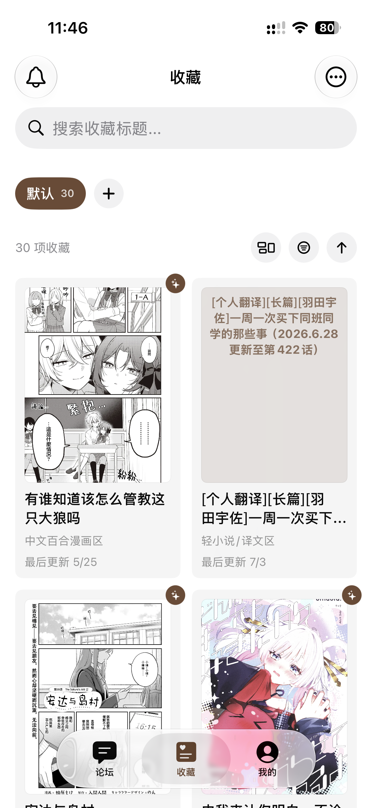
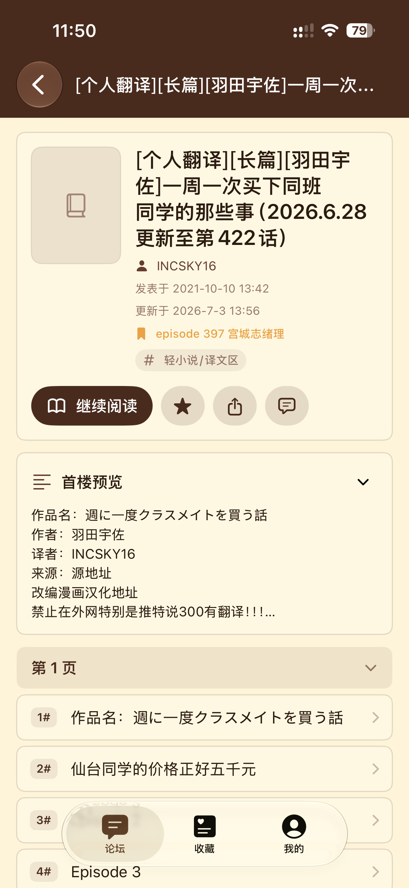
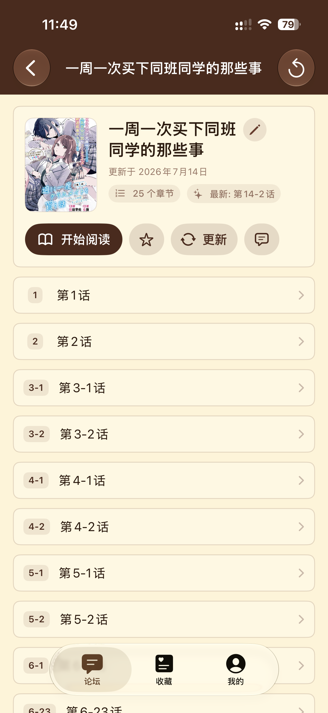
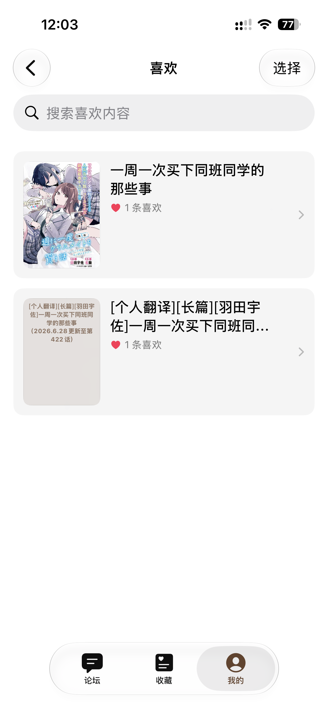
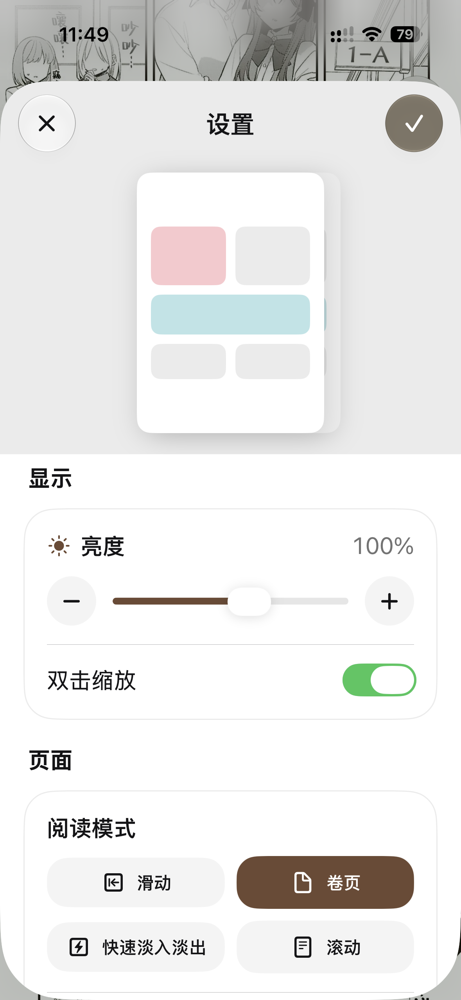
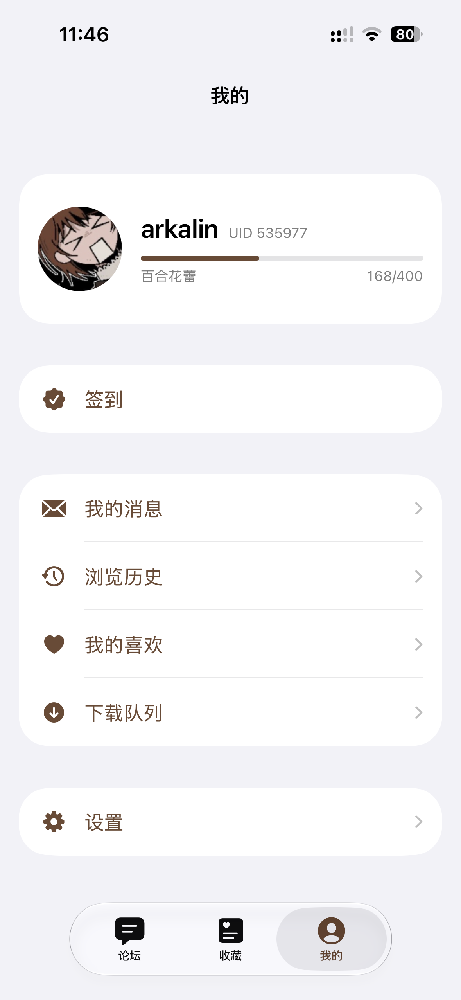

# Yamibo X

<p align="center">
  
</p>

<p align="center">
  <strong>Yamibo X</strong><br>
  面向百合会论坛的非官方 iOS 综合客户端
</p>

<p align="center">
  <a href="https://github.com/Arkalin/YamiboX/releases"></a>
  
  
</p>

> [!IMPORTANT]
> Yamibo X 在功能设计上参考了 [prprbell/YamiboReaderPro](https://github.com/prprbell/YamiboReaderPro) 和 [LittleSurvival/yamibo-app](https://github.com/LittleSurvival/yamibo-app) 等项目。感谢原作者及所有相关项目贡献者。

## 项目简介

Yamibo X 是面向百合会论坛的非官方 iOS 阅读客户端。项目围绕原生阅读体验，整合论坛浏览、收藏管理、浏览历史、小说阅读和漫画阅读等功能，并针对 iPad 做了适配。

## 功能概览

- 可插拔的板块阅读：可自定义 `普通`/`小说`/`漫画`/`智能漫画` 板块阅读模式.
- 类 `Apple Books` 原生阅读器：支持 `小说`/`漫画`/`智能漫画` 阅读。
- `小说`阅读器：支持 滑动/卷页/快速淡入淡出/滚动 四种阅读模式、翻页方向、字体字号行距页边距、iPad横屏双页等排版设置、正文图片、章节目录、章节评论与阅读进度保存。
- `漫画`阅读器：支持 滑动/卷页/快速淡入淡出/滚动 四种阅读模式、翻页方向、画面缩放、边缘填充、iPad横屏双页等排版设置、章节评论与阅读进度保存。
- `智能漫画` 阅读器：在`漫画`阅读器的基础上，自动识别、聚合归属于同一漫画的所有章节帖子并提供目录管理功能（感谢[prprbell/YamiboReaderPro](https://github.com/prprbell/YamiboReaderPro)及上游项目提供的设计与实现参考）。
- 论坛浏览：基于原生组件提供百合会论坛浏览入口，支持历史记录、`小说`/`智能漫画`详情页（感谢[LittleSurvival/yamibo-app](https://github.com/LittleSurvival/yamibo-app)提供的设计与实现参考）。
- 本地收藏管理：同步论坛收藏，支持分类、合集、标签、手动排序、搜索、批量操作、更新检查与更新通知、封面管理（感谢[LittleSurvival/yamibo-app](https://github.com/LittleSurvival/yamibo-app)提供的设计与实现参考）。
- 我的喜欢：阅读器中的精选摘录，支持文本、图片、作品和摘录项二级列表浏览、卡片化展示与搜索。
- 离线缓存：可断点续传的下载队列，支持`小说`/`漫画`/`智能漫画`阅读器缓存，`小说`缓存自动更新。
- 外设支持：支持Apple Pencil (Pro)、游戏手柄和键盘控制阅读器翻页与章节评论查看，并可自定义按键绑定。
- 数据同步：支持通过 WebDAV 备份和恢复收藏、阅读进度与设置。
- 剪贴板识别：支持识别`bbs.yamibo.com`开头的链接并在论坛页原生打开。
- 签到：支持 基于 iOS 快捷指令-自动化 实现的自动签到和手动签到功能。

## 界面预览

<p align="center">
  
  
  
  
  
  
  
  
  
</p>

## 使用方式

### 安装使用

从 [Releases](https://github.com/Arkalin/YamiboX/releases) 下载最新的 `.ipa`，通过 [AltStore](https://altstore.io) 等工具签名安装；也可以点击下方按钮，通过 AltSource 添加软件源后在 AltStore 内安装和更新。

<a href="https://celloserenity.github.io/altdirect/?url=https://raw.githubusercontent.com/Arkalin/YamiboX/main/app-repo.json" target="_blank">
   
</a>

### 系统要求

iOS 18.0 及以上，支持 iPhone 和 iPad。

### 更新方式

应用可在“我的 - 关于”页手动检查新版本，检测到更新后会提示下载地址和更新说明；通过 AltStore 软件源安装的用户也可以直接在 AltStore 内检查并安装更新。

## 数据与安全

- 登录状态、收藏、历史、阅读进度和缓存等数据保存在设备本地或来自百合会论坛账号本身。
- WebDAV 同步使用用户自行配置的服务器，数据不会经过任何第三方服务器。
- 请只从本仓库 Releases 或上方 AltSource 安装 `.ipa`，避免使用来源不明的改包版本。
- 清理应用数据、卸载应用或更换设备可能导致本地历史、缓存和设置丢失。

## 内容边界

- 本项目为非官方客户端，与百合会论坛运营方无隶属关系。
- 请遵守目标论坛规则、版权要求以及所在地法律法规。
- 论坛内容、图片和用户发表的信息来自原站点，其版权与内容责任归原始来源所有。
- 本项目在功能设计上参考了相关上游项目，相关来源与许可证信息请同时参考本仓库的 [LICENSE](./LICENSE)。

## 开发者

仓库通过 [`Package.swift`](Package.swift) 定义核心模块：

- [`Sources/YamiboXCore`](Sources/YamiboXCore)：数据模型、网络访问、HTML 解析、缓存、同步与本地存储
- [`Sources/YamiboXUI`](Sources/YamiboXUI)：SwiftUI 界面、论坛容器、收藏页、小说阅读器与漫画阅读器
- [`Sources/YamiboXTestSupport`](Sources/YamiboXTestSupport)：跨测试目标共享的测试基础设施
- [`YamiboX`](YamiboX)：独立 iOS App 入口，对应 Xcode 工程 [`YamiboX.xcodeproj`](YamiboX.xcodeproj)
- [`Tests/YamiboXCoreTests`](Tests/YamiboXCoreTests) / [`Tests/YamiboXUITests`](Tests/YamiboXUITests)：核心与界面测试

依赖：[`Kanna`](https://github.com/tid-kijyun/Kanna)、[`GRDB.swift`](https://github.com/groue/GRDB.swift)、[`Nuke`](https://github.com/kean/Nuke)

环境要求为 Swift 6.2+、iOS 18+，以及支持 Swift 6.2 工具链的 Xcode 版本。在仓库根目录执行测试，将示例中的模拟器名称替换为本机可用的 iOS Simulator：

```bash
xcodebuild test \
  -project YamiboX.xcodeproj \
  -scheme YamiboX \
  -testPlan YamiboXTests \
  -destination 'platform=iOS Simulator,name=iPhone 16' \
  -collect-test-diagnostics never \
  CODE_SIGNING_ALLOWED=NO
```

如果需要在模拟器或真机中运行，使用 Xcode 打开 [`YamiboX.xcodeproj`](YamiboX.xcodeproj) 并构建 `YamiboX` App target。

## 许可协议

本项目依据 [GNU AGPL-3.0](./LICENSE) 发布。

第三方依赖和相关项目以其原作者或原项目的许可证声明为准。

相关项目：

- [prprbell/YamiboReaderPro](https://github.com/prprbell/YamiboReaderPro)
- [flben233/YamiboReader](https://github.com/flben233/YamiboReader)
- [LittleSurvival/yamibo-app](https://github.com/LittleSurvival/yamibo-app)
- [KrelinnBios/YamiboReaderLite](https://github.com/KrelinnBios/YamiboReaderLite)

## 反馈与贡献

欢迎通过 [GitHub Issue](https://github.com/Arkalin/YamiboX/issues) 提交使用问题、兼容性问题、功能建议或其他改进建议。
