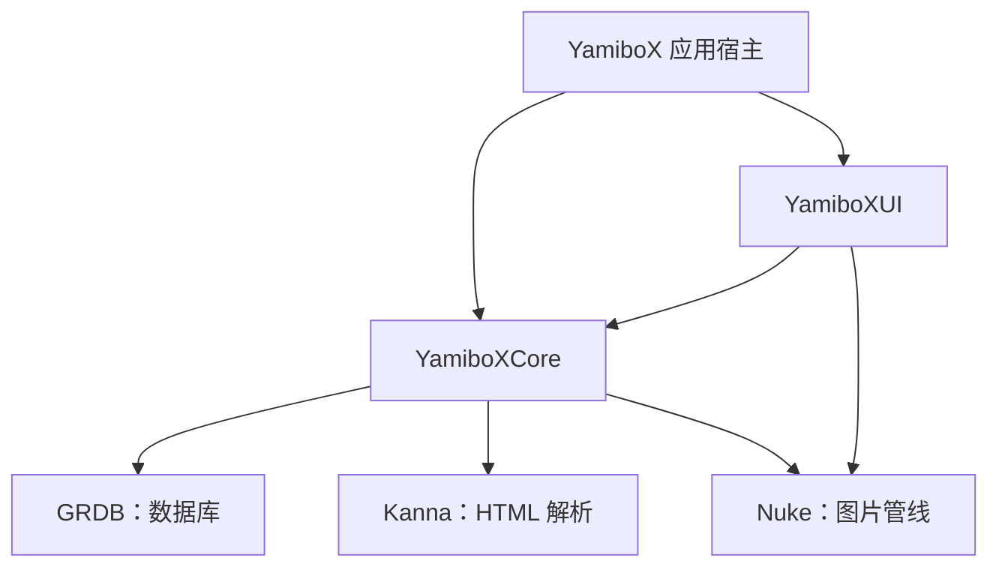
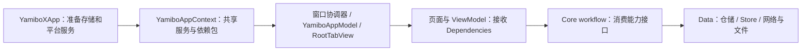

# 架构总览

本文说明当前源码的职责与依赖边界。构建配置以 [`Package.swift`](../Package.swift) 为准，开发环境与验证方式见[本地开发入门](development/local-development.md)和[验证指南](tests/README.md)。

## 编译边界

YamiboX 使用 Swift 6.2+，最低支持 iOS 18。Swift package 中只有两个源码 target：`YamiboXCore` 与 `YamiboXUI`，各自导出同名 library product；Xcode 工程中的 `YamiboX` 是应用宿主。



箭头表示依赖。Core 不反向依赖 UI。`Reader`、`Forum`、`Library` 等是同一 target 内的功能目录，不是独立 Swift module，也没有各自的编译准入。

[阅读器模块边界提案](../openspec/changes/enforce-reader-module-boundaries/proposal.md)描述了七个源码 targets 的未来布局；它不是当前实现，不能据此使用不存在的 `YamiboXReader` target 或宣称阅读器已经完全隔离。

## Core：数据与业务流程

| 目录 | 当前职责 |
|---|---|
| `App` | 共享服务装配、运行时协调、账号转换、数据重置与应用连续性 |
| `Account`、`Forum` | 账号流程、论坛领域模型、页面能力、表单与站点解析 |
| `ContentDetail`、`Library` | 内容详情、书架与收藏、更新检查及封面规则 |
| `Reader/Novel`、`Reader/Manga` | 两种阅读器的领域模型、仓储、内容投影、阅读 workflow 和目录规则 |
| `Reader/Shared` | 作品身份、位置排序、路由恢复、阅读进度、评论契约、下载与共用投影加载 |
| `Bookmark`、`Like`、`History` | 注解、喜欢与浏览历史的模型、流程、合并和持久化 |
| `Settings`、`Sync`、`Update` | 设置、WebDAV 同步、更新信息 |
| `Infrastructure` | 网络、HTML、图片数据、背景、日志与本地化基础能力 |
| `Persistence` | 数据库连接、迁移注册、通用持久化工具与跨业务身份协调 |

功能目录按实际需要采用三层，不为小功能补空目录：

- **Domain**：值模型、身份、排序、纯转换、合并规则与领域约束。
- **Application**：用例流程、workflow，以及业务消费的能力契约。
- **Data**：具体仓储、HTML 适配、SQL、文件存储与远端服务实现。

Domain/Application 不直接导入 GRDB、Kanna、Nuke。业务 Store 和 schema 由业务目录拥有，公共 `Persistence` 不接管所有业务 SQL。历史数据库迁移是版本契约，不因运行时重构随意改写。

Core 不承载 UIKit、SwiftUI、WebKit 等界面与系统交互实现，但并非只包含与 Apple 平台无关的纯 Swift。小说布局模型使用 CoreGraphics，文本运行时契约也使用 Foundation 的富文本类型；具体 TextKit 对象图仍由 UI 实现。

## UI：界面与平台实现

| 目录 | 当前职责 |
|---|---|
| `AppEntry` | 窗口、导航、应用级展示状态、启动协调与平台服务装配 |
| `Features` | 按业务组织的页面、视图模型、协调器和私有组件 |
| `SharedUI` | 跨功能组件、主题、背景、注解展示及展示辅助 |
| `Platform` | UIKit/WebKit、图片与照片、通知、后台任务等平台适配 |
| `Resources` | 包内图片、本地化等 UI 资源 |

UI 通过 Core 的模型、依赖包与能力接口访问数据，不直接导入 GRDB 或 Kanna。SwiftUI 与 UIKit 视口、TextKit 排版、系统权限和后台任务调度均留在 UI/应用宿主。

跨功能组件放入 `SharedUI`，避免反向引用 `Features` 的私有实现。例如通用封面缩略图可以共享，收藏徽章和合集拼图仍属于收藏功能。通用背景基础设施也不能依赖收藏设置模型或阅读器工具栏样式。

## 装配与调用路径



- [`YamiboXApp`](../YamiboX/YamiboXApp.swift)先打开数据库并完成存储准备，再创建运行时；失败留在启动页提供重试，不暴露部分升级的服务。
- [`YamiboAppContext`](../Sources/YamiboXCore/App/YamiboAppContext.swift)拥有共享数据库池、会话、图片管线和 Store，装配 `ForumDependencies`、`NovelReaderDependencies` 等业务依赖包。GRDB Store 复用同一个数据库池。
- [`YamiboAppModel`](../Sources/YamiboXUI/AppEntry/YamiboAppModel.swift)继续承担应用导航、阅读会话展示和窗口级状态。功能页不通过 `appModel.appContext` 临时查找服务，而是在装配处获得显式依赖。
- 平台服务由宿主创建，经 Core 契约注入。例如 WebKit 数据清理、WAF 恢复、更新通知和下载后台观察不由 Core 直接调用系统框架。
- 依赖包中既有能力接口、工厂，也有共享 Store；这不是全面的协议化架构。优先收窄实际消费的能力，不为每个实现机械创建镜像协议。

账号转换和数据重置由各自 workflow 执行，Context 负责装配而非内联执行顺序。同步数据集的 participant 与变更源成对注册。阅读会话的内容生命周期由阅读器协调器拥有，不把所有异步状态收回应用模型。

## 架构检查能保证什么

从仓库根目录运行：

```sh
bash scripts/check-architecture.sh
```

[`check-architecture.sh`](../scripts/check-architecture.sh)是 CI 构建前执行的轻量源码检查，当前覆盖：

- Core 禁止导入 UI module 及脚本列出的界面、通知、后台任务、照片、手柄框架。
- Domain/Application 禁止直接导入 GRDB、Kanna、Nuke；UI 禁止导入 GRDB、Kanna。
- 共享背景不依赖收藏、设置页面模型或 Reader 私有工具栏实现。
- 账号 Application 不直接解析 HTML 或发出具体传输请求；收藏更新、漫画目录读取通过其能力契约。
- 小说 Application 不调用 Like Store/解析器；Like Application 不依赖小说具体 projection Store。

这些检查不是 Swift 符号依赖图，也不穷尽同一 target 内的跨功能调用。脚本通过只能证明已列出的源码约束没有命中，不能证明目录独立、业务正确、资源完整或界面可用。修改共享边界时仍需审查依赖，按[验证指南](tests/README.md)执行适当的 Local 构建与交互验证。当前 package 没有测试 target，不以旧 `swift test` 流程代替验证。

## 技术专题

- [阅读器设计](architecture/readers.md)：内容投影、布局、视口、进度与会话生命周期。
- [论坛接入、认证与路由](architecture/networking-and-routing.md)：页面请求、解析、认证与网页回退。
- [持久化、作品身份与迁移](architecture/persistence-and-identity.md)：存储归属、身份协调与版本边界。
- [下载、缓存与封面存储](architecture/downloads-and-storage.md)：离线数据、技术缓存、清理和后台能力。
- [编辑器与草稿设计](architecture/forum-editor.md)：文档模型、可视投影与提交边界。

本总览保留长期职责与维护入口，不记录逐次修复经过、临时日志路径或某次历史验收结果。
