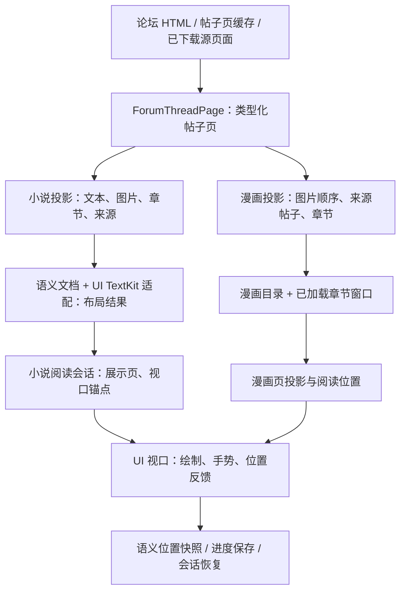
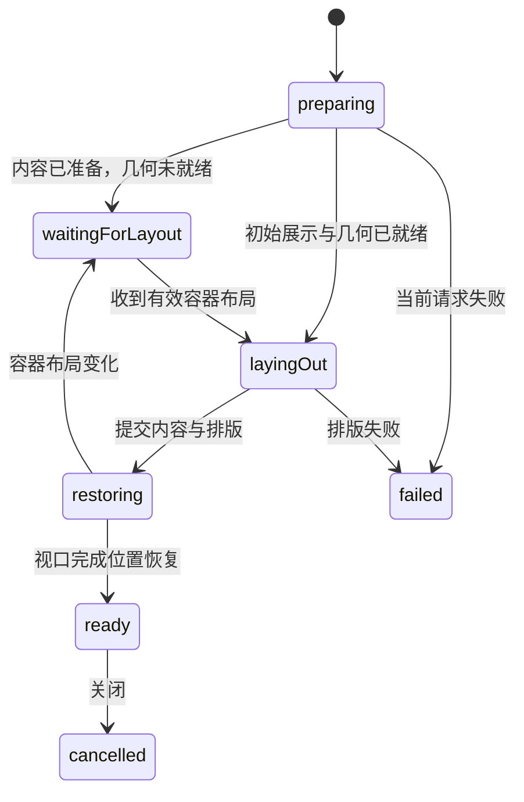

# 阅读器设计

本文面向修改阅读器的开发者，说明当前小说与漫画的内容、位置和生命周期边界。用户操作说明由 Wiki 提供；模块关系见[架构总览](../architecture.md)。

阅读器不是独立 target。Core 拥有模型、仓储和阅读 workflow，UI 拥有视口、TextKit、交互与展示协调，两者通过同一 Swift package 中的公开或 `package` 契约协作。

## 从论坛内容到阅读界面

### 共享投影加载

[`ReaderProjectionLoader`](../../Sources/YamiboXCore/Reader/Shared/Projection/ReaderProjectionLoader.swift)与帖子页加载策略共用以下步骤，小说和漫画适配器分别负责投影形状、指纹和离线数据读取：

1. 解析请求身份：帖子 `tid`、论坛页 `view`、作者范围。没有作者时先读发现页，确定有效作者。
2. 正常加载可复用对应的帖子页缓存，否则经公共网络客户端获取 HTML 并解析为 `ForumThreadPage`。这里的“在线加载路径”不等于每次都发网络请求。
3. 使用源内容指纹及对应的 schema/parser 版本判断 projection 是否可复用；不匹配则重新派生。强制刷新跳过正常缓存复用。
4. 只有符合策略的传输/响应失败才尝试已下载源页面回退。取消、解析失败、需要登录或安全验证、持久化失败不被一律吞成“离线”。

帖子页与投影是技术缓存，下载内容是用户保存的离线数据，两者不能混为一类。投影缓存写入失败会记录诊断，已成功派生的内容仍可展示。离线回退不表示服务器上的访问权限或内容问题已被解决。

## 小说：投影、排版与位置

### 三种页与坐标

| 概念 | 含义与维护要求 |
|---|---|
| 论坛页 `view` | 源帖子分页请求的页码，不是排版后的屏幕页码 |
| segment / 章节身份 | 投影中的文本或图片段落及其来源、章节身份，支持评论、喜欢、书签和回到原帖 |
| surface / 展示页 | 在当前字号、版式、容器和阅读模式下产生的显示区域，重新排版后可变化 |

[`NovelReaderProjection`](../../Sources/YamiboXCore/Reader/Novel/Domain/NovelReaderProjection.swift)保存正文段落、图片、章节语义、来源帖子及内容指纹。投影不是按设备字号分好的页面，也不是一份丢失来源关系的 HTML 字符串。

Core 的 `NovelTextLayout` 准备语义文档和坐标索引。UI 的 `DefaultNovelTextLayoutRuntimeAdapter`创建具体 TextKit 候选对象图，生成布局索引；`NovelTextViewportRuntimeOwner`在 Core 内管理当前代次、布局结果和运行时图的引用。绘制、命中和选区几何通过这个契约回到 UI 实现。

持久化投影的字符范围与 TextKit 的 UTF-16 范围不是同一单位。`NovelTextCoordinateIndex`负责字符边界转换，文档、段落偏移也有不同的类型。处理表情、组合字符、选区或摘录时应复用这些索引，不把整数偏移直接跨空间传递。

### 阅读 workflow 与提交

[`NovelReadingWorkflow`](../../Sources/YamiboXCore/Reader/Novel/Application/NovelReadingWorkflow.swift)拥有当前源投影、单个预取投影、阅读 session、布局运行时与发布状态；`NovelReadingSession`负责展示页选择、章节导航和语义阅读位置。

- workflow 是调用方隔离的非 `Sendable` 对象，UI 正常在 MainActor 上拥有它；同步视口采样不额外跨 actor。可发送的语义准备输入可在后台处理，不能把活动 TextKit 对象图作为跨线程值发送。
- 布局变化先准备候选事务，在请求仍有效时提交运行时图、session 和 presentation。失败或已过期候选不替换最后有效展示。
- 字体、字号、排版、容器与阅读模式变化需要重新评估布局；仅改变表面外观的设置使用现有布局更新 presentation，不应无条件重新构造整份文档。
- 绘制引用、surface、选区和搜索定位都与运行时代次关联。新布局提交后，旧视口回调不能继续绘制或改写新文档的位置。

滚动、滑动分页和卷页视口是不同 UI 实现。`NovelReaderPagedContent`与`NovelReaderVerticalContent`分别建立观察边界，读取已提交的结构、布局与交互依赖；它们不自行加载论坛内容，也不各自创建一份完整的独立 TextKit 文档来替代会话运行时。

### 初次展示与运行时变化

这是主要展示路径，不是所有取消/重试分支的完整状态机。

| 所有者 | 负责的状态 |
|---|---|
| `NovelReaderPreparationCoordinator` | 初次展示阶段、准备任务、取消代次、布局请求版本及首次显示等待 |
| `NovelReaderLoadingCoordinator` | 仓储/workflow 创建、已准备数据、当前加载、后续缓存/下载状态刷新、访问历史 |
| `NovelReaderRuntimeUpdateCoordinator` | 外观、布局、iPad 展示输入的更新决策、请求准入与失败回滚 |
| `NovelReaderViewModel` | 已提交状态的展示映射、导航、工具栏、浮层与进度保存入口 |

初次打开可并行准备仓储、设置和已有进度，但同步 TextKit 索引等待初始显示与有效几何，避免在入场过渡帧阻塞界面。布局提交后先进入恢复阶段，视口报告恢复完成才进入 `ready`，不能把“仓储已返回”当作“用户可见位置已恢复”。

关闭同时使准备、布局和后续加载结果失效。强制刷新等待旧准备任务退出后替换数据；异步成功与失败都校验请求代次、关闭状态以及 workflow 身份，避免旧失败提示或旧布局覆盖新会话。

### 小说恢复与预取

`NovelResumePoint`保存论坛页、章节身份、文本段身份、显示文本偏移、章节序号、段内进度、作者及阅读模式提示；它不是仅保存滚动像素或展示页序号。

入口共享 `NovelReadingResumeResolver`的位置优先级：精确锚点优先，其次已有论坛页码，再使用入口默认值；作者范围随锚点或进度保留。“从头阅读”清除位置而不清除作者范围。入口仍分别负责标题、来源、预览和默认值策略。

分页/滚动视口将当前显示位置采样回语义位置；布局变化后按锚点映射到新展示页。目录、搜索、书签和喜欢的非线性跳转由导航协调器维护前进/后退历史；异步跳转成功才执行视口恢复与注解刷新，失败不制造一条成功导航记录。

小说 workflow 保留一个下一份文档预取结果，显式越过当前文档边界时提升为当前文档；不在普通显示页切换时无条件重发同一个论坛请求。图片预取由 UI 协调器管理，内存压力可以停止预取和清除展示缓存，不应删除用户下载内容。

## 漫画：目录、章节窗口与显示页

### 两种内容范围

[`MangaReaderProjection`](../../Sources/YamiboXCore/Reader/Manga/Domain/MangaReaderProjection.swift)包含源帖子、作者、论坛页、章节标题和有序图片 URL。builder 从作者范围内的帖子图片提取顺序并去重；图片字节由图片管线按需加载，projection 本身不等于已下载的漫画文件。

- **智能漫画模式开启**：目录 workflow 解析/读取作品目录，`MangaChapterWindow`维护当前及已加载相邻章节。
- **智能漫画模式关闭**：跳过智能目录解析请求，构造当前章节的单章目录，不聚合兄弟帖子，不自动更新智能目录。

目录是可持久化的作品/章节关系，章节窗口是当前会话的加载状态。不能通过改显示标题或窗口数组替代目录身份提交。目录重命名、合并、删除章节与同步涉及持久化身份，参见[持久化与作品身份](persistence-and-identity.md)。

### 稳定位置与双页显示

`MangaReaderPageProjection`同时保存章节内 `localIndex` 和当前加载窗口中的 `globalIndex`：前者属于来源章节，后者随前后章节加载而变化。

导航位置使用 `MangaReadingPosition(tid, localIndex)`。进度快照还保存章节源页 `chapterView`、作品/目录身份和章节信息，不使用窗口全局序号作为持久化锚点。双页、阅读方向、缩放与滚动改变的是展示布局，不能把两页组合或缩放坐标编码成新的章节身份。

UI 提供竖向集合视口、滑动分页与卷页视口。分页交互内部区分纯几何/导航模型、输入、渲染与 runtime；单页和双页共享显示坐标的边缘规则，各自保留手势和缩放状态。

### 生命周期与提交边界

[`MangaReaderWorkflow`](../../Sources/YamiboXCore/Reader/Manga/Application/MangaReaderWorkflow.swift)拥有目录 workflow、章节窗口、presentation，以及 session、位置、导航、目录修改代次。异步章节加载在返回后重新核对当前窗口和目标，只有当前请求可以提交；UI 侧“不发布旧结果”不能代替 workflow 内“不修改新窗口”的检查。

`MangaReaderLifecycleCoordinator`管理准备、章节跳转、相邻预取、目录/书签观察与注解刷新任务，并独立记录内容版本。被替换任务取消后仍保留到退出，重试等待旧任务结束才替换 workflow。关闭停止既有功能模块并使旧请求失效；设置和最终进度写入不归入可丢弃的展示任务。

`MangaReaderNavigationCoordinator`拥有非线性导航历史、请求代次与连续阅读后的历史过期规则。ViewModel 执行内容恢复并返回成功、失败或中止，导航协调器据此提交或丢弃候选，不通过 getter/setter 把导航状态分散在多个所有者。

接近窗口边缘时 workflow 可预取相邻章节。漫画 projection loader 合并同身份的并发请求，让用户跳章可等待已有预取，而不是重复获取同一源页。图片预取是另一层：滑动与卷页各自持有 `MangaPagedImagePrefetchSession`，共用去重与停止规则，不共享会话手势或生命周期。

## 会话、注解与外部能力

### 会话与恢复路由

[`ReaderSession`](../../Sources/YamiboXUI/Features/Reader/Shared/ReaderSession.swift)表示一个导航入口，可在小说、漫画和原帖之间切换，分别记住阅读模式上下文。嵌入论坛导航列的原帖进入阅读器时可交接为全屏会话，导航依赖由宿主显式传入。

`contentID`区分会话中的内容切换；旧模式退出时保存的位置不能覆盖新模式恢复路由。应用级 `ReaderResumeRoute`用于继续阅读与窗口连续性，不应与阅读器内部“上一个搜索结果/返回跳转”历史混用。

### 进度与失败

- 阅读进度由共享 Store 与同步协调能力持久化，浏览历史由 history workflow 记录；这两类数据的用途不同。
- 读取进度失败不是“没有记录”，不能直接回到默认位置并覆盖原进度。
- 尚无有效 presentation 的小说退出时不保存默认位置。预览会话不写普通阅读活动；漫画也仅从已加载的当前页生成保存快照。
- 最终保存入口等待其 flush。部分退出保存失败以日志记录，不能因此宣称进度已经成功落盘或同步；排错应查对应的持久化/同步诊断。

### 注解、评论、图片与下载

- `ReaderAnnotationService`执行书签、笔记和喜欢的元数据操作；`ImageLikeCaptureService`处理图片捕获。阅读器提供来源锚点，不自行复制 Like/Bookmark 的 SQL 或文件补偿规则。
- 小说 workflow 只输出当前/预取 projection 快照，由会话级 `NovelReaderAnnotationCoordinator`协调计数、锚点、高亮、捕获与观察。喜欢功能通过只读 projection 能力查询缓存，不反向依赖具体 Store。
- 章节评论经 `ReaderChapterCommentsLoading`与共享评论模块加载；来源帖子与作者信息保留在 projection，不按工具栏上显示的页码猜测评论目标。
- 读图、预取和离线文件使用共享图片/下载能力。阅读器下载面板消费下载队列依赖，队列执行、后台运行与文件完成判定不由视口负责。
- 相册保存、键盘/手柄/Apple Pencil 输入、安全区及窗口环境属于 UI 平台能力。Core 提供规则与契约，不读取全局当前窗口替代宿主输入。

离线、技术缓存、封面文件的所有权和清理规则见[下载、缓存与封面存储](downloads-and-storage.md)，认证、WAF 与路由回退见[论坛接入与路由](networking-and-routing.md)。WebDAV 同步阅读元数据不等于同步小说正文、漫画图片或封面文件。

## 修改时的验证重点

按[验证指南](../tests/README.md)使用 Local App 与本地论坛，不恢复旧单元/UI 测试 target，也不引用历史性能数字作为当前验收。

| 变更范围 | 至少覆盖的交互场景 |
|---|---|
| 内容投影/加载 | 作者范围、多论坛页、正文带图片、强制刷新、合法离线回退与真实解析/权限错误 |
| 小说布局/视口 | 字号与模式切换、旋转/iPad 尺寸变化、双页、包含表情的选区、搜索/书签恢复 |
| 漫画窗口/目录 | 单章模式、智能目录、多章预取、快速跳章、目录修改后当前位置、单/双页切换 |
| 生命周期/导航 | 加载中关闭、刷新时切换、连续发起跳转、失败重试、旧回调到达、原帖与阅读器切换 |
| 进度/注解/下载 | 退出再进入、预览不写进度、保存失败诊断、注解增删、下载后离线进入和清理后的恢复 |

性能调查先分清网络、投影、语义准备、TextKit 索引、视口绘制与持久化阶段，再比较相同内容、设置和设备条件下的结果。已有诊断计数只能辅助定位，不为阅读器文档设定未经测量的新性能阈值。
